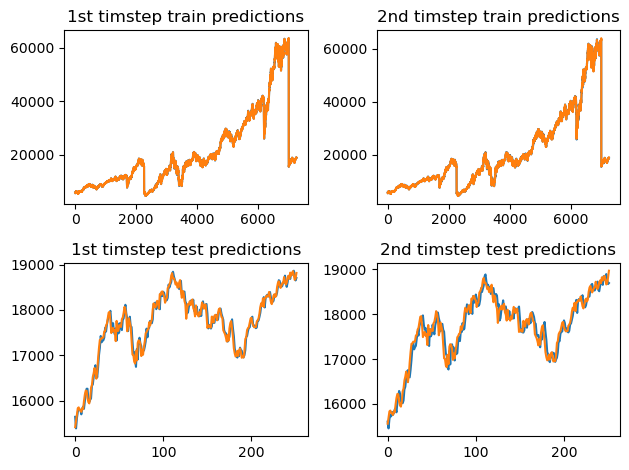

# Final Model Performance

# Experiments:

## Regressors:
### Statistical
CatBoost, LGBM, **Linear Regression**, Ridge
### Deep learning
LSTMs, State space models ([SpaceTime](https://github.com/HazyResearch/spacetime))

## Features
* Using only Close price (autoregressive)
* Using Open, Close, High, Low, Volume (given features)
* Using technical indicators (Bollinger bands, Moving Average Convergence Divergence, Commodity Channel index)

Filtered signal from noise by selecting top 600 out of 1201 features using RFE (recursive feature elimination), which selects a pruned set of n most important features.

While the prediction was for NSE data, I augmented the data using BSE data, more than doubling the dataset size and yielding a much better result.

